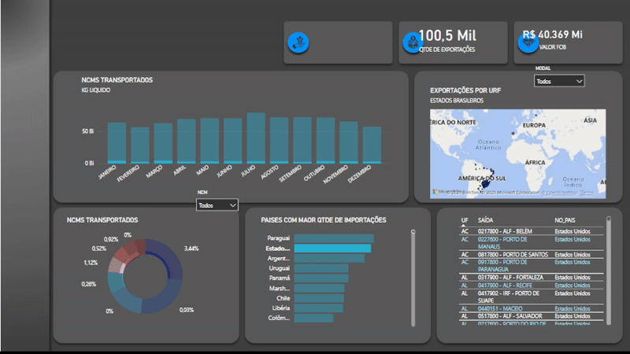
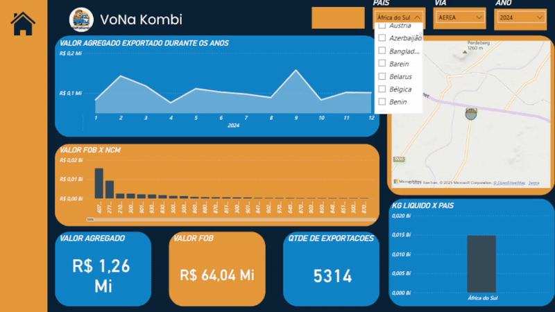
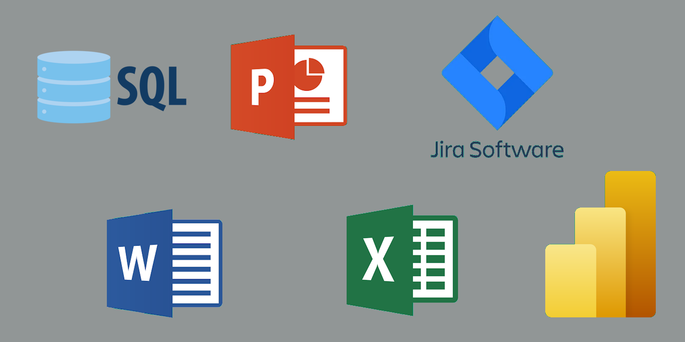

# API-2-Sem

 
 

# Proposta
 Realizar uma análise minuciosa sobre o fluxo logístico e comercial de produtos no território nacional brasileiro, investigando detalhadamente as rotas, modais de transporte e regiões de maior circulação de mercadorias. Além disso, examinar os principais destinos internacionais envolvidos nas relações de importação e exportação, identificando os países com maior relevância nas trocas comerciais e os tipos de produtos movimentados
# MVP
## Primeiro Sprint

Foi montado um dashboard indicando a quantidade e o valor FOB exportado, onde é possivel escolhaer cada país de destino, cada mês e o modal

## Segundo Sprint

 
 O layout foi alterado, de maneira que ficasse mais claro e com identidade. Erros na filtragem de dados foram corrigidos, pois foi usado o SQL para divisão dos dados em tabelas específicas. Além de que paraísos fiscais foram excluidos

## Terceiro Sprint
 
 Para tornar o dashboard mais dinâmico, foi criado um menu que pode levar o usuario para quatro telas diferentes, cada uma focada em um tipo de dado: quilograma líquido, valor FOB, valor agregado e URFs.
 Nessas telas foram adiocionados mais informaçoes e filtros, como a projeção para o ano de 2025 e também a média de exportação por valor agregado e valor FOB

 
 <h1>Link do Dashboard</h1>

 

 # Ferramentas Utilizadas
 - Jira Software
 - Excel
 - Power Point
 - Microsoft Word
 - Sublime Text
 - Power BI

 # Aplicabilidade das Ferramentas
 ##  Para facilitar o tratamento dos dados, foi feita a filtragem e posterior substituição dos códigos dos municípios por seus respectivos nomes com o objetivo de organizar e analisar os dados comerciais dessas regiões, facilitando a interpretação e uso posterior.

 

 ### Jira Software
  Através dele foi desgnada a tarefa e o prazo das atividades de cada membro do projeto, indicando o nivel de prioridade de cada tarefa a ser realizada e em qual sprint devem ser entregues organiando em anexos os outros aplicativos utilizados

 ### SQL
  As planilhas usadas como base para as informações não eram suportadas pelo Excel por conta de seu tamanho, então os dados foram manipulados através do SQL, que permite que diferentes arquivos de texto sejam executados simultaneamente em abas diferentes
 ### Excel
  Com as informações filtradas, obtivemos planilhas organizadas com apenas o necessário. O que futuramente será usado para a apresensação de dashboards no Power Bi.

  
  
 # Backlog do Produto
 

 
 

# Equipe
<table>
<tr>
<td>Scrum Team</td>
 <td>Breno Conrado</td>
<td></td> 
</tr>
 <tr>
  <td>Scrum Team</td>
<td>Eduardo Pereira</td>
<td></td> 
</tr>
 <tr>
  <td>Scrum Team</td>
<td>Gabriel Poffo</td>
<td></td> 
</tr>
 <tr>
  <td>Scrum Team</td>
<td>Kauê Venâncio</td>
<td></td> 
</tr>
 <tr>
  <td>Scrum Master</td>
<td>Leonardo Rocha</td>
<td></td> 
</tr>
 <tr>
  <td>Scrum Team</td>
<td>Mateus Alexandre</td>
<td></td> 
</tr>
 <tr>
  <td>P O</td>
<td>Pedro Hernandes</td>
<td></td> 
</tr>
 <tr>
  <td>Scrum Team</td>
<td>Yago Martins</td>
<td></td> 
</tr>
</table>
